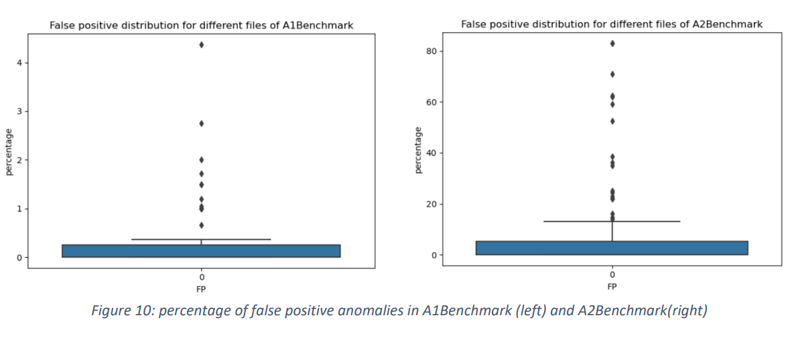

# Anomalous Record Detection (ARD) by Seasonal Artificial Neural Network (SANN)
Data corruption can occur at any level in various complex systems all the time and is required to be detected and repaired as much as possible. Therefore, detecting the corruption in data is fundamental and sometimes too difficult. In this study, we aim to employ a specific type of artificial neural network (ANN) for time-series dataset which can be known as one of the most appropriate methods for this type of data because it considers the seasonality in the data structure. Seasonal artificial neural network (SANN) will be trained and tested on univariant dataset of Yahoo server traffic records. This method will use a seasonal set of subsequent traffic values in dataset to forecast the next traffic dataset based on the previous observations. The particular structure of time-series data provides this opportunity for us. Experiments on two benchmark attribute datasets illustrates the effectiveness of proposed method on univariance time-series dataset. It demonstrates that if any corruption happened in univariant time-series dataset, it could be detected and even the estimated value which should have been happened is predicted as well. 
## Introduction 
The time-series data like figure 1 is the sequenced data whose data are transferred from one to the next by a very specific and organized pattern. However, similar to figure 2, they can be corrupted because they are recorded by various sources, such as network servers, Internet of Things (IoT) and so on[9]. They are struggling with noises, disruptions, and different disorders naturally can happen in real-world. Hence, these incorrect records may lead to make mistakes for critical and fatal decisions. So, by accurate and timely anomaly diagnosis, serious financial and business losses can be avoided.[2] For example, just 1 minute downtime of an automotive plant due to an anomaly may cost up to 20,000 US dollars.[5] pinpointing the root causes of the anomalies is the of detecting them. For instance, it identifies which system component has generated the anomaly; it helps the sensor would be repaired before creating a disaster. [1,2] 
Therefore, we need to predicate the aforementioned patterns in time-series data to be capable to detect the wandering from the known patterns as anomalies. The first step to detect the outliers in dataset is to figure out the relationships among the records and attributes of dataset using their trend and seasonality. As time series contain infinite numbers, this type of problems (NP-hard) cannot be solved as regular approaches. So, they need to be analyzed by machine-learning techniques. One of the well-structured approaches is Seasonal Artificial Neural Network (SANN) which is one of the most compatible techniques with the introduced input data. SANN is able to learn the seasonality existing in data structure. [3] However, input and output neurons and hidden layers and neurons and the seasonality parameter “s” can be determined by experiments completely. I have used codes and network structures by [6] and made some changes to make it consistent with our dataset.  When the traffic value is predicted by model, the difference between the real traffic value and predicted traffic value will be found and by a threshold, we can label weather outlier is occurred at that timestamp or not. The promising results of the proposed framework can be seen in various domain such as science, industry, society and so on. This systematic testing technique is able to recognize unexpected values among the univariant time series as anomalous records and outliers. [9]

## Approach
Seasonal Artificial Neural Network (SANN) is a type of Multi-Layer Perceptron (MLP) which is designed to model non-linear relationship among dataset records. An MLP is a Neural Network (NN) which is containing a set of neurons in different layers (input, hidden, and output) that neurons just can connect to each other if they are in 2 subsequent layers. Moreover, SANN is adapted to be more compatible with sequenced data. The parameters of fitness function of this machine-learning technique are trained in a way to predict the seasonal records of one period based on previous ones. Figure 3 shows why recurrency idea in SANN is plausible. [3] 

This network employs the ith seasonal period observation as input neurons and is trained to predict the (i+1)th seasonal period as output neurons. Here, based on the previous experiments in the outlier detection team (Hajar et al.), we consider seasonality parameter s equals to 24. So, we need to divide data with overlap to assign input and output neurons. According to recommendation by [3] we construct the network with only 1 hidden layer and 4 neurons. In addition, the activation function for the hidden and output layers are sigmoid and linear functions, respectively. Figure 4 can help us to understand the network architecture better and easier.

Yt+l (l = 1,2,. . . , s) are representing the predictions for the future s periods and Yt-i (i = 0,1,2,. . . , s _ 1) are the observations of the previous s periods, vij (i = 0,1,2,. . . , s _ 1; j = 1,2,. . . ,m) are weights of connections from input layer neurons to hidden layer neurons, wjl (j = 1,2,. . . ,m; l = 1,2, . . . , s) are weights of connections from hidden layer neurons to output layer neurons, αl(l = 1,2,. . . , s) and θj (j = 1,2, . . . ,m) are weights of bias connections and f is the activation function. All these parameters are formulated to equation 1 which expresses the output of SANN:

The model is generated by Keras package and fit by 10 epochs and 10 batches. I am aware of the number of epochs is not adequate because I do not have sufficient time to increase the number of epochs efficiently. Data is divided to 80%,10%,10% and assigned to training set, validation set and test set, respectively. When the predicted traffic values are delivered by the model, we can compare them with the real traffic values to find the outliers. If the difference between predicted and real value for a timestamp is greater than threshold, that timestamp is labeled as outlier. Finding the appropriate value for threshold is complicated and significantly important. Because by shifting that just a bit a data label can change completely from positive to negative and vice versa. We can use another co-learner to find the threshold and classify data. However, because of lack of time, this is not a good option. I have adjusted that dynamically based on the data in each file. It can be defined easily based on the standard deviation of normalized values in dataset since this parameter is a good representative of data changes. In the following subsection, we will analyze the method from different aspects.
### Goal of the evaluation: 
The evaluation illustrates how well the SANN can fit on Yahoo dataset and finds the most possible outlier in time-series data. It helps to see when anomalies will occur and remove the roots of them. 
### Metrics used:
There are some well-known statistical metrics for binary classifying such as true positive, false positive, true negative, false negative, recall, precision and F1 score which will be defined at below:
True positive is the number of timestamps which are correctly labeled as anomaly among the traffic dataset and True negative is the number of the timestamps correctly identified as non-anomaly. False positive and negative are incorrectly labeled data entries. [7] The precision is true positive divided by the number of all predicted anomalies (including both correct and incorrect predicted anomaly). Also, the recall is the number of true predicted anomalies over the number of samples with the real label of anomalies. You can see a visual representation of these metrics by Venn diagram which is showed in figure 5. Finally, the F1 score represents the harmonic mean of precision and recall and is a thorough summary of results for binary classification. [8]

### Steps used to perform each evaluation:

I have used 2 benchmarks which are collected in Yahoo dataset [4] because they are univariant time-series data as might be expected. It records time-dependent attribute called traffic_value. The timely manner anomaly diagnosis in the addressed dataset is considerably important because if anomalies happen, Yahoo user’s data can be exposed to potential security threats.  I will program SANN with the Python language using the professional Pycharm. It requires employing different libraries such as numpy, tensorflow, matplotlib, etc. I had a couple of meetings with the outlier detection group virtually to choose this dataset. Yahoo dataset is less messy compared to Yahoo-mutated dataset. Moreover, I need a univariant dataset; so, Nasa dataset is not useful for this purpose. 
## Results

### Discussion
Figure 6 is an area plot for TP and all existing anomalies in each dataset. You can see in the left figure of 6 that for some csv files, the predicted anomalies are overlapped on real anomalies perfectly. But sometimes the model is not capable to predict anomalies. I can say the reason is not the failure of the model, but the dataset is involved with some shortcoming of real-world impacts. Figure 7 depicted one of non-ideal time-series datasets. As you can see, it does not contain any pattern and affected by a lot of outliers. If the number of the outliers is significantly large, the model is mistakenly trained on anomalies not the non-anomalies. These results are totally consistent with the point from [9] that ”The values of records in a season are considered to be dependent only on the values of the previous season. As a result, the network can only learn short-term dependencies between data records.”. However, the model fits on the syntactic dataset perfectly as right figure 6. All the left figures of 8,9,10, and 11 together show that the model mostly makes the mistake to predict the anomalies (positive labels). While it does not label data with anomaly while they are not. Also, it behaves very satisfying about negative data (non-anomaly). However, all the right figures 8,9,10, an 11 represent the high capability of model to be fit on the more ideal time-series dataset. Figure 10 shows SANN produced more FP for A2Benchmark. Figure 12 displays the F1 score as a good representative for both precision and recall when the class distribution is uneven. (the number of negative samples is much greater than the number of positive samples. In other words, the positive samples are underrepresented). We can see the F1 score distribution for A2Benchmark is more desired compared to A1Benchmark. So, it has more accurate results for synthetic data. Because of this distribution of dataset, confusion matrix is not a convenient choice to analyze the results as figure 13 shows that.
### Threats to validity
It is worth mentioning that although this method performs effectively on the Yahoo dataset, we cannot infer that this is the best approach for all time-series dataset. Because there is not any result from other methods for anomalous record diagnosis that lets us compare the results and state various conclusion. Also, we need to test the model on other time-series dataset which can lead to generalization. Moreover, there are hyperparameters, tuning parameters and structure variables which are selected based on previous studies which did not prove their quality. So, more time is required to test different values for existing parameters. 
. External validity: As I mentioned because it is not applied on other dataset with different types and sizes; so, we cannot claim that it works 100% properly on others.
. Internal validity: Additionally, following previous discussion, no variables effects are evaluated. Hence, nobody can say which parameters (e.g. threshold value, number of hidden layers, …) should be utilized. I tried to use some treatments for variables and fix other values and see the changes in the results effectiveness. For example, I tried to change the threshold value based on the available dataset values dynamically while other hyperparameters were considered fixed.
. Construct validity: statistical tests are the best-established ones for analyzing the results of prediction and binary classification. 
## Related work
I was going to compare the results of SANN with the implemented methods by the “Outlier Detection Team” in terms of accuracy, precision, and recall. The team methods include Autoregressive (AR) model, Moving Average (MA) Model, Autoregressive Integrated Moving Average (ARIMA) Model, Seasonal and Trend decomposition using Loess (STL), Holt Winters (HW) Exponential Smoothing, and Long Short Term Network (LSTM), since all of them are executed for univariant outlier records detection. Unfortunately, I cannot access to their results. So, I just mention some disadvantages of them. AR, HW, and ARIMA are just compatible with data records by linear association which makes them inapplicable for many non-linear problems. MA is suffering form big complication of the model fitness. LSTM is not clear to be interpreted to draw conclusions by human. [9]

## Conclusion 
The addressed approach tries to test the quality of time series to verify that they do not violate the specific constraints for dataset. The outlined results are promising; however, I am going to suggest using a taxonomy for different types of time-series dataset such as low-level dependent time-series or high-level dependent time-series. 
Sometimes, real-world dataset values are not created by an organized pattern which we pre-suppose about ideal time-series dataset. So, instead of just changing parameters and structures of network blindly, we should take steps in a systematic technique. I mean, we should know dataset and then the model can be constructed accordingly. I know me and other members of group use a constant value for seasonality semi-randomly. I propose to choose the value based on the dataset pattern specifically. Moreover, because anomalies can happen at some early timestamps, and the model is not trained on them adequately, if I could to try the approach again, I preferred to use cross-validation technique instead of hold-out one to avoid large function loss for the first periods of data.

## References
[1] Guo, T., Xu, Z., Yao, X., Chen, H., Aberer, K. and Funaya, K., 2016, October. Robust online time series prediction with recurrent neural networks. In 2016 IEEE International Conference on Data Science and Advanced Analytics (DSAA) (pp. 816-825). Ieee.
[2] Zhang, C., Song, D., Chen, Y., Feng, X., Lumezanu, C., Cheng, W., Ni, J., Zong, B., Chen, H. and Chawla, N.V., 2019, July. A deep neural network for unsupervised anomaly detection and diagnosis in multivariate time series data. In Proceedings of the AAAI Conference on Artificial Intelligence (Vol. 33, pp. 1409-1416).
[3] Hamzaçebi, C., 2008. Improving artificial neural networks’ performance in seasonal time series forecasting. Information Sciences, 178(23), pp.4550-4559.
[4] Laptev, N., Amizadeh, S., Billawala, Y., A Benchmark Dataset for Time Series Anomaly Detection. [Online]. Available: https:// yahooresearch.tumblr.com/post/114590420346/a-benchmark-dataset-for-time-series-anomaly
[5] Djurdjanovic, D., Lee, J. and Ni, J., 2003. Watchdog Agent—an infotronics-based prognostics approach for product performance degradation assessment and prediction. Advanced Engineering Informatics, 17(3-4), pp.109-125.
[6] https://github.com/gakhov/pycon-ua-2018/blob/master/artificial-neural-networks.ipynb
[7] https://en.wikipedia.org/wiki/Sensitivity_and_specificity
[8] https://en.wikipedia.org/wiki/F-score
[9] Homayouni, H., 2021. Anomaly Detection and Explanation in Big Data (Doctoral dissertation, Colorado State University).
